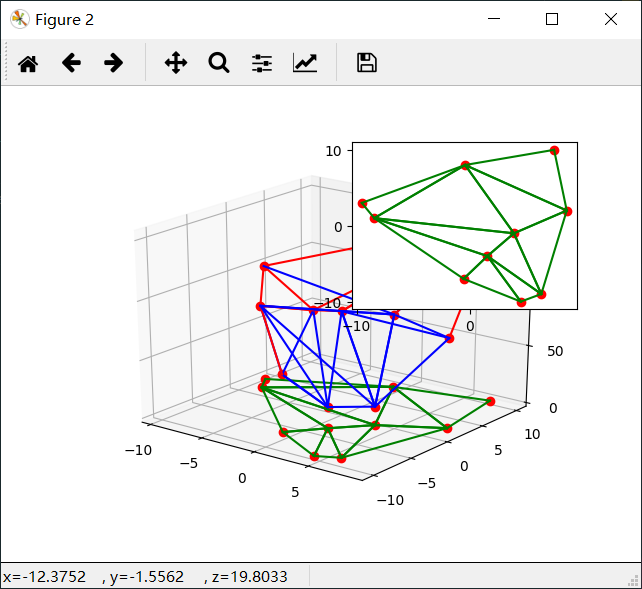
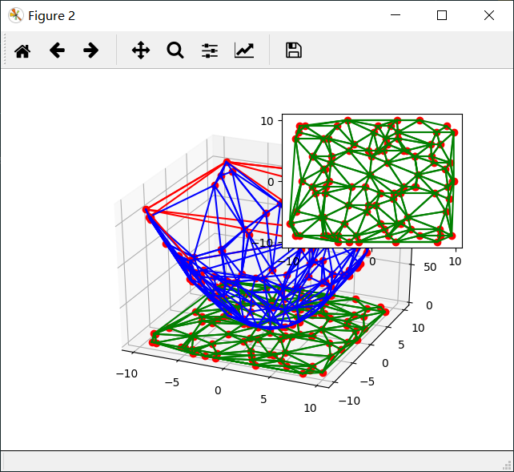

# Delaunay Triangulation Lifting Algorithm

Using PyHull(based on qHull) to calculate the convex hull of lifting vertices.

- Blue edges are the reserved edges of lifting convex hull
- Red edges are the deleted edges of lifting convex hull
- Green edges are the 2d Delaunay triangulation

10 points Delaunay Triangulation  

---
100 points Delaunay Triangulation  

## Requirements
    pyhull
    numpy
    matplotlib